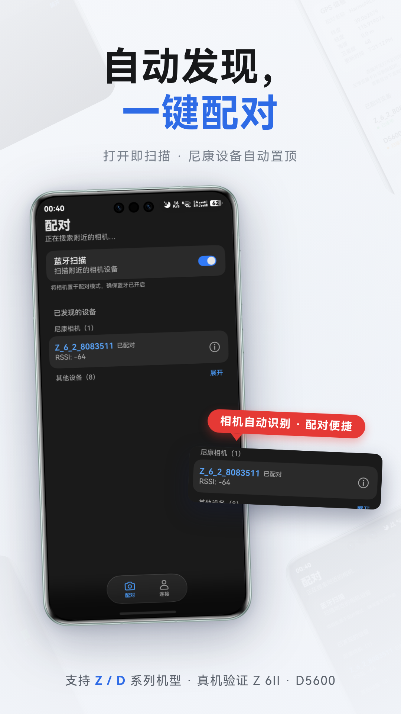
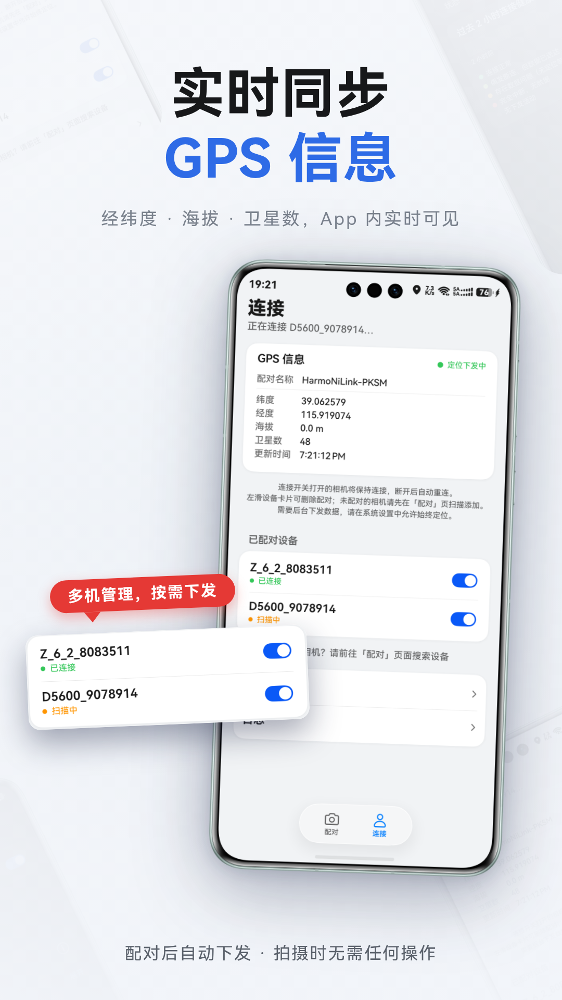
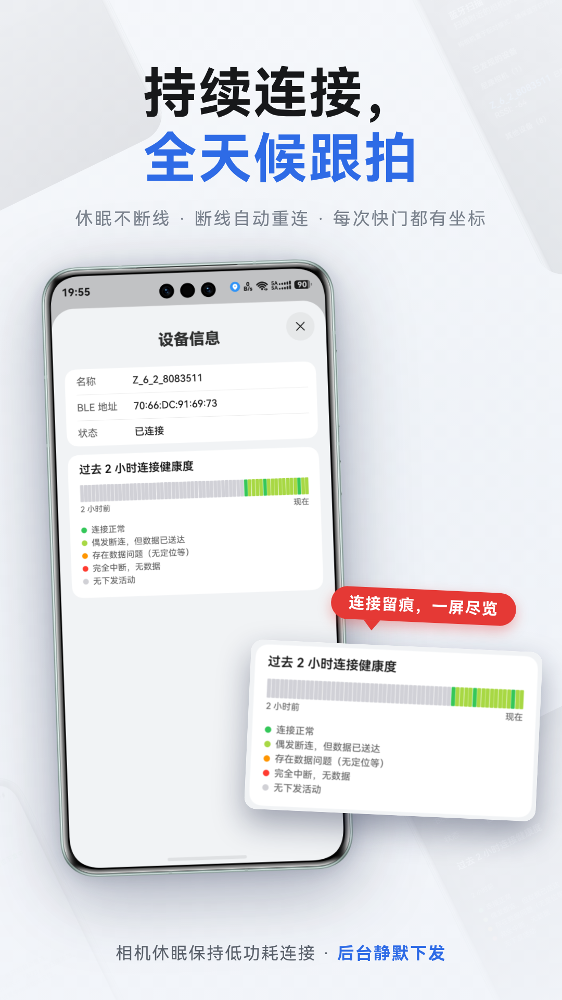
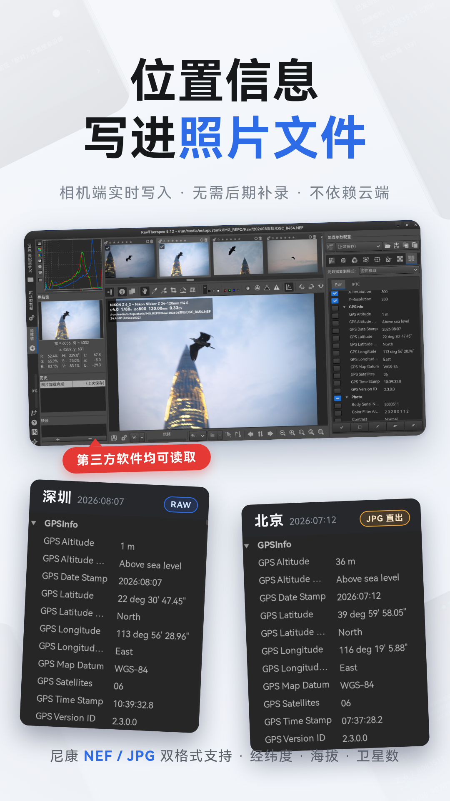

# HarmoNiLink — Nikon Smart GPS for HarmonyOS NEXT

[](./LICENSE)

> Inspired by [hurui200320/nsg](https://github.com/hurui200320/nsg)，
> 基于 [gkoh/furble](https://github.com/gkoh/furble) 逆向的 Nikon BLE 智能设备协议。

HarmoNiLink 让 HarmonyOS 手机/平板替代 SnapBridge，向尼康 Z / D 系列相机**持续分发 GPS 坐标**。连接后全自动运行 — 相机休眠时保持低功耗连接，App 在后台静默传输位置数据。

由于鸿蒙系统在卓易通使用 SnapBridge 存在功能异常（截止作者测试），遂开发此应用代替之

---

## 应用预览

<p align="center">
  
&nbsp;
  
</p>
<p align="center">
  
&nbsp;
  
</p>

---

## 功能特性

### 全自动 GPS 分发
扫描、配对、GPS 传输全流程自动化。首次配对需用户确认系统弹窗，之后所有操作（含休眠唤醒重连）均无需手动介入。若后台进程被系统中断，回到前台会自动恢复并给出提示。

### 两档定位模式（实测功耗驱动）
连接页 GPS 卡内一键切换，按拍摄场景权衡精度与耗电：

| 模式 | 定位方式 | 更新 | 整机功耗* |
|------|---------|------|----------|
| **精确** | 卫星定位（GNSS 引擎工作） | 约 10 秒一次 | 约 1.0–1.15 W |
| **省电** | 网络定位（GNSS 引擎休眠） | 约 10 分钟保底 | 约 0.7–0.8 W |
| （对照）不运行应用 | — | — | 约 0.76–0.80 W |

\* 熄屏静止整机均值，MatePad Pro 2024，两轮各 10–20 min 分段实测。

实测结论：**GNSS 引擎开/关是功耗的主变量**——省电档较精确档省 0.2–0.36 W（约 −25%），而省电档整机功耗与不运行应用噪声内不可分辨——即蓝牙连接与坐标下发的功耗成本同样淹没在噪声内，功耗大头始终在 GNSS 引擎。

### 智能扫描分组
扫描时通过蓝牙广播中的服务特征（0xDE00）自动识别尼康相机并置顶分组（`Z_6_2_...`、`D5600_...`），手机、耳机、打印机等其他设备收进折叠区——多相机、嘈杂环境一目了然，不再大海捞针。

### 位置信息写入照片 EXIF
拍摄时，相机接收到的位置信息（可在相机「连接至智能设备」-「位置数据」查看）由相机写入 RAW / JPG 照片的 EXIF 元数据。照片导入电脑或手机相册后自带地理坐标，地图模式自动归位；尼康 NEF / JPG 双格式均支持，不依赖云端，第三方软件均可读取。

### 连接健康看板
每一台已配对相机都记录最近 2 小时的连接健康度，四级状态直观呈现（正常 / 偶发断连 / 定位异常 / 完全中断）；已配对设备左滑查看看板，删除设备也在同一左滑菜单中。

### 多相机同时连接
可同时连接多台尼康相机，每台独立开关、独立管理，一台休眠或断线不影响另一台；多台共享同一份定位数据，互不干扰。超出实测稳定数量（2 台）时会提示一次，可自行判断是否继续。

### 相机休眠兼容
尼康相机进入休眠后维持 BLE 低功耗连接，GPS 数据持续写入。若连接意外中断（深度休眠 / 超出距离），自动执行指数退避重连。Z 系列与 D 系列（D5600 等）均已适配——D 系列较慢的连接建立与经典蓝牙配对时序（需 BLE 连接完全释放后才可被发现）自动处理，无需手动干预。

### 鸿蒙原生后台保活
基于 `BLUETOOTH_INTERACTION` + `LOCATION` 双长时任务（模式随连接状态动态调整），不依赖无声音频等取巧手段。若长时任务被系统取消或挂起，回到前台会自动重新拉起并弹窗说明中断原因。

### 连接状态引导
当相机端正在等待另一台已配对设备时（多台手机配对过同一台相机），App 会自动提示在相机【已配对设备】中切换当前设备，不再无声重试。

### 多设备可区分
每台安装自动生成唯一配对名称（`HarmoNiLink-XXXX`），写入相机并显示在相机端已配对列表，多台手机同时配对同一台相机时互不混淆；连接页可随时查看本机名称。

### 评分邀请机制
内置克制的评分引导：仅在应用真正交付价值后（首次成功下发 GPS 满 48 小时、且近期连接健康）一次性弹出邀请，「谢绝」进入 7 天冷却，「去评分」后永久关闭；不满足条件绝不打扰。

### 原生鸿蒙体验
- **HDS 设计套件** — 沉浸光感、模糊标题栏、自适应背景材质；小窗模式下 Tab 栏自动适配底距
- **亮/暗主题跟随** — 自动跟随系统色彩模式
- **大屏适配** — 折叠屏展开 / 平板全屏铺满，无平行视界空白
- **纯 ArkTS 实现** — Blowfish 加密全程 ArkTS 运算，零原生依赖

---

## 使用指引

1. 相机开启蓝牙配对模式，手机开启蓝牙与定位功能，打开应用后按照页面指引完成相机的蓝牙搜索与配对
2. 在连接页面打开对应相机的连接开关，应用会自动持续向相机下发 GPS 坐标信息。GPS 信息可以在相机「连接至智能设备」-「位置数据(智能设备)」中查看
3. 相机拍摄照片时将自动记录获取到的位置信息到 RAW/JPG 的元数据，便于后期整理分类

---

## 支持的设备

| 平台 | 要求 |
|------|------|
| 手机 / 平板 | HarmonyOS NEXT（运行要求 API 23 / SDK 6.1.0 及以上；构建于 SDK 26.0.0 · API 26） |
| 相机 | 尼康 Z 系列（Z 6II、Z 7II、Z 8、Z 9、Z f 等）与 D 系列（D5600 等） |

> ✅ Z 6II、D5600 真机验证通过；其他型号欢迎测试反馈。

---

## 权限

| 权限 | 用途 | 说明 |
|------|------|------|
| 蓝牙（发现附近设备） | 扫描、配对、连接相机 | 首次扫描时申请 |
| 位置（精确位置） | 向相机下发 GPS 坐标 | 首次扫描时申请，请在弹窗中选择精确位置 |
| 后台定位（始终允许） | 相机休眠 / 应用在后台时持续下发 GPS | **可选**。首次授予定位权限后，应用会主动弹出系统授权引导，按提示即可设为「始终允许」，可随时跳过（会略微增加耗电）；也可之后在系统设置中手动修改 |

后台定位未开启时：连接保持，但应用切到后台后 GPS 停止下发，回到前台自动恢复。

---

## 架构

```
entry/src/main/ets/
├── ble/
│   ├── BleClient.ets                  — GATT 客户端
│   ├── BleScanner.ets                 — BLE 设备扫描
│   └── protocol/
│       ├── NikonPairingEngine.ets      — 4 阶段配对握手
│       ├── BlowfishHasher.ets          — Blowfish hash（纯 ArkTS）
│       ├── GeoPayloadGenerator.ets     — 41 字节 GPS 载荷
│       └── TimePayloadGenerator.ets    — 时间载荷
├── pages/
│   ├── MainPage.ets                   — 标签页容器
│   ├── PairingPage.ets                — 扫描 & 配对
│   └── ConnectionPage.ets             — 连接状态 & 设备管理
├── components/
│   ├── DeviceHealthSheet.ets          — 设备信息 & 连接健康度看板
│   ├── AboutSheet.ets                 — 关于面板
│   └── CommentDialog.ets              — 应用市场评价弹窗
├── service/
│   ├── CameraService.ets              — 多相机连接 Hub（会话/共享扫描/互斥/状态广播）
│   ├── CameraSession.ets              — 单相机会话：连接/握手/重连退避
│   ├── ClassicBonding.ets             — 经典蓝牙绑定协调器
│   ├── GpsDispatcher.ets              — GPS 单时钟分发（TIME/GEO 轮写）
│   ├── BackgroundTaskKeeper.ets       — 长时任务生命周期 & 中断提醒
│   ├── PermissionsGateway.ets         — 按需权限申请
│   ├── SlaHub.ets                     — 连接健康度追踪注册表
│   └── RatingPrompt.ets               — 评分弹窗门槛
├── data/
│   ├── PreferencesRepository.ets      — 已配对设备 & 控制器名称持久化
│   └── SlaTracker.ets                 — 健康度时间轴（2h 环形槽）
└── entryability/
    └── EntryAbility.ets               — 入口 & 生命周期
```

| 层 | 技术 |
|---|---|
| UI | ArkTS / ArkUI · `@kit.UIDesignKit` |
| BLE | `@ohos.bluetooth.ble` · `@ohos.bluetooth.connection` |
| 定位 | `@kit.LocationKit` |
| 后台 | `backgroundTaskManager` — `BLUETOOTH_INTERACTION` · `LOCATION` |
| 构建 | hvigor-ohos-plugin 6.26.4 · arm64-v8a |

---

## BLE 协议概要

```
Base UUID: 0000xxxx-3dd4-4255-8d62-6dc7b9bd5561

Service  0xDE00
  ├── 0x2000 (PAIR)  配对握手 — Blowfish 3 阶段 17 字节消息
  ├── 0x2002 (ID)    写入控制器名称（HarmoNiLink-XXXX）— 32 字节 ASCII
  ├── 0x2007 (GEO)   写入 41 字节 GPS 载荷
  └── 0x2008 (NOT1)  通知通道 — 相机状态
```

- **加密**：Blowfish/ECB/NoPadding · 密钥 `FF FF AA 55 11 22 33 00`
- **Hash**：自定义 CBC-MAC（Big-Endian 32-bit word 级）
- **GEO 载荷**：WGS-84 · 经纬度/海拔/卫星数/UTC · 41 字节

---

## 构建

环境：[DevEco Studio](https://developer.huawei.com/consumer/cn/deveco-studio/) 或 [Command Line Tools for HMOS](https://developer.huawei.com/consumer/en/download/command-line-tools-for-hmos)，SDK **26.0.0（API 26）**，hvigor-ohos-plugin 6.26.4。构建产物兼容 API 23（SDK 6.1.0）及以上设备（compatibleSdkVersion 6.1.0(23)）。

```bash
make hap     # 开发调试 — 未签名 .hap
make app     # 未签名 .app
make build   # 两个都构建

make sign    # 构建 + 双层签名 → .hap + .app（需先 cp .env.example .env 并填密码）
make clean   # 清理构建产物
```

产物 (`make sign` 后)：
- `build/outputs/default/HarmoNiLink-default-signed.hap` — 签名模块包
- `build/outputs/default/HarmoNiLink-default-signed.app` — 签名应用包

> 需要使用 **API 24 工具链**构建？检出到 v2.4.2 标签即可：`git checkout v2.4.2`（最后一个以 SDK 6.1.1 · API 24 构建的版本，compatibleSdkVersion 相同）。

---

## 灵感来源

本项目为独立重实现

### [nsg](https://github.com/hurui200320/nsg)
由 **skyblond** 开发的 Android Kotlin 参考实现（AGPL-3.0）。本项目的协议流程、配对握手、载荷格式均基于其公开的协议分析重新实现。

### [furble](https://github.com/gkoh/furble)
由 **Guo-Rong Koh** 开发的 ESP32 多品牌相机遥控器（MIT）。最早逆向 Nikon BLE 智能设备协议并公开文档。

---

## 许可证

[Mulan Permissive Software License v2](./LICENSE) © 2026 octopustank
